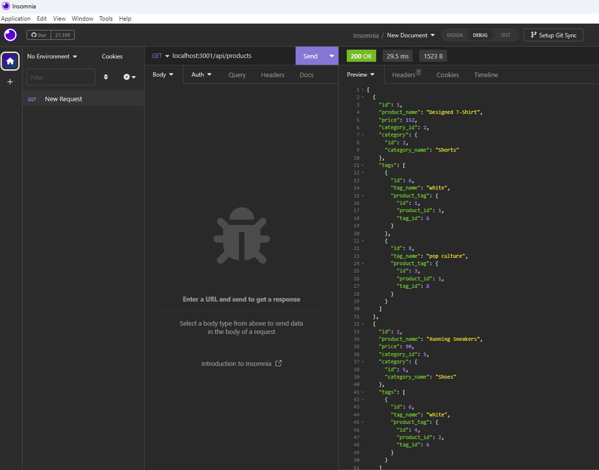

# E-commerce Back End

# Description

This project consists of an E-commerce Back End website. I worked with Express.js API and used Sequelize to interact with the MySQL database. I was provided with a seeds database, and I built the models category, product, tag, and productTag. I also created the routes GET all, GET by id, POST, PUT, and DELETE. I used Insomnia to see the results of the user request of create, update, and delete data from the database.

# Table of Contents

- [Installation](#installation)
- [Usage](#usage)
- [Credits](#credits)
- [Contributing](#contributing)
- [Tests](#tests)
- [Questions](#questions)
- [License](#license)

# Installation
I have installed node in my computer, also in the terminal I installed dotenv, express, mysql2, and sequelize.

# Usage

The user can use the application through Insomnia.

Link to the walkthrough video that demonstrates the functionality of the README generator [Click here to watch the video](https://drive.google.com/file/d/1JWQ6nLAlJXl_aPxYdmCH3aWkpYCD73ES/view)

# Credits
- 

# Contributing
Please email me if you want to contribute to my work.

# Tests
The tests were performed in Insomnia.

# Questions
Link to my github profile [Github](https://github.com/ginitadavis/)
If you have any questions, you can reach me via email at gina.vera.davis@gmail.com

# License

            
            MIT License

Copyright (c) 2013 Mark Otto.
Copyright (c) 2017 Andrew Fong.
Permission is hereby granted, free of charge, to any person obtaining a copy of this software and associated documentation files (the "Software"), to deal in the Software without restriction, including without limitation the rights to use, copy, modify, merge, publish, distribute, sublicense, and/or sell copies of the Software, and to permit persons to whom the Software is furnished to do so, subject to the following conditions:
The above copyright notice and this permission notice shall be included in all copies or substantial portions of the Software.
THE SOFTWARE IS PROVIDED "AS IS", WITHOUT WARRANTY OF ANY KIND, EXPRESS OR IMPLIED, INCLUDING BUT NOT LIMITED TO THE WARRANTIES OF MERCHANTABILITY, FITNESS FOR A PARTICULAR PURPOSE AND NONINFRINGEMENT. IN NO EVENT SHALL THE AUTHORS OR COPYRIGHT HOLDERS BE LIABLE FOR ANY CLAIM, DAMAGES OR OTHER LIABILITY, WHETHER IN AN ACTION OF CONTRACT, TORT OR OTHERWISE, ARISING FROM, OUT OF OR IN CONNECTION WITH THE SOFTWARE OR THE USE OR OTHER DEALINGS IN THE SOFTWARE.